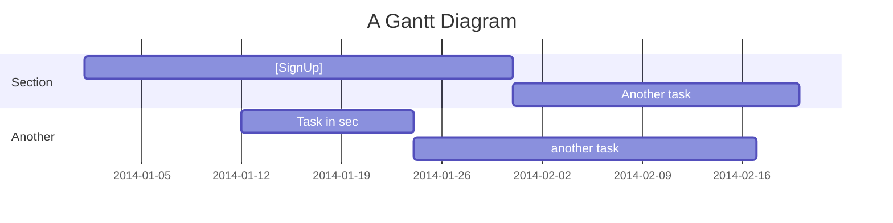

## 항해99 실전 프로젝트
## **뽀득뽀득**

- 보드게임매칭서비스
#### 프로젝트 상세설명
---
2022.11.3 ~ 2022.12.9 까지 1주간 진행된 클론프로젝트

구성인원: FE 3명/ BE3 명

---

### 와이어프레임 
   

### 라이브러리 
---
- 회원가입 React-Hook-Form + yup 사용
- 카카오map Api 
---
### 추가기능
- **가장 가까운 거리로 매칭해주는 서비스** (geolocation 과 geocoder, geolib의 getdistance를 통해 좌표값끼리 거리를 직접 계산)
- **무한슬라이드구현** (useInview 훅과 react-intersection-observer 라이브러리 사용)
- **실시간 채팅구현** (socket.io 라이브러리 사용)

---
### 폴더구조
---
```
├─ .github
│  ├─ PULL_REQUEST_TEMPLATE.md
│  └─ vi ISSUE_TEMPLATE.md
├─ .gitignore
├─ package.json
├─ public
│  ├─ favicon.ico
│  ├─ index.html
│  ├─ logo192.png
│  ├─ logo512.png
│  ├─ manifest.json
│  └─ robots.txt
├─ README.md
├─ src
│  ├─ App.js
│  ├─ Components
│  │  ├─ dd
│  │  ├─ Login
│  │  │  ├─ KaKaoLogin.js
│  │  │  └─ Login.js
│  │  ├─ MyPage
│  │  │  └─ MyPage.js
│  │  └─ SignUp
│  │     └─ SignUp.js
│  ├─ hooks
│  │  ├─ CookieHook.js
│  │  ├─ dd
│  │  └─ UseInput.js
│  ├─ index.js
│  ├─ instance.js
│  ├─ Pages
│  │  ├─ dd
│  │  ├─ LoginPage.js
│  │  ├─ Mypage.js
│  │  └─ SignUpPage.js
│  ├─ redux
│  │  ├─ config
│  │  │  └─ configstore.js
│  │  └─ modules
│  ├─ shared
│  │  └─ Router.js
│  ├─ style
│  │  ├─ dd
│  │  ├─ Header.js
│  │  └─ Layout.js
│  └─ tools
│     └─ dd
└─ yarn.lock

```

  

---

